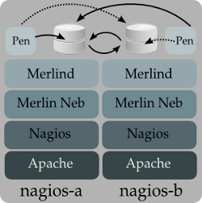

Appendix
________

Merlin Installation
===================

.. warning:: 

    This installation is used to test steamer in a merlin environment, 
    and thus, it is very **specific to the author** and may be outdated.
        
.. cssclass:: fright 
   

    |merlin-setup|

This install recipe it is based on Ubuntu server 11.10 with a LAMP software
selection, and may be outdated, please refer to the merlin docs.
It consists of two merlin poolers, and two master-master mysql databases 
(circular replication) which are accessed by ``merlind`` via an active/passive
software tcp-balancer called `pen <http://siag.nu/pen/>`_.

The idea is simple: merlin daemons connect to the pen balancer on its own machine,
both balancers point to the same database, lets say nagios-a's database, and
both of them uses nagios-b's database as the emergency server (``-e host:port``).

Basically, there are 3 parts here:

    * `Nagios source installation`_ 
    * `Replicated mysql configuration`_ 
    * `Merlin source install and configuration`_

    
Nagios source installation
~~~~~~~~~~~~~~~~~~~~~~~~~~

If you didn't select the lamp software selection, you could need some packages like "php5, mysql-server, and apache2"

.. code-block:: sh

    > sudo apt-get install git-core php5-cli libdbd-mysql libdbi0-dev build-essential 
    > sudo apt-get install libgd2-xpm-dev pen libmysqlclient-dev 
    > sudo mkdir -p /opt/local/src && cd /opt/local/src
    > sudo chown $USER /opt/local/src
    > git clone git://git.op5.org/nagios.git
    > wget http://prdownloads.sourceforge.net/sourceforge/nagiosplug/nagios-plugins-1.4.15.tar.gz
    >
    > sudo /usr/sbin/useradd -m -s /bin/bash nagios
    > sudo passwd nagios
    > sudo /usr/sbin/usermod -G nagios nagios
    > sudo /usr/sbin/groupadd nagcmd
    > sudo /usr/sbin/usermod -a -G nagcmd nagios
    > sudo /usr/sbin/usermod -a -G nagcmd www-data
    >
    > cd nagios
    > ./configure --with-command-group=nagcmd --prefix=/opt/local/nagios
    > make all
    > sudo make install install-init install-config install-commandmode
    >
    > cd /opt/local/src
    > tar xzf nagios-plugins-1.4.15.tar.gz && cd nagios-plugins-1.4.15
    > ./configure --with-nagios-user=nagios --with-nagios-group=nagios --prefix=/opt/local/nagios
    > make
    > sudo make install

Replicated mysql configuration
~~~~~~~~~~~~~~~~~~~~~~~~~~~~~~

Run mysql_secure_installation, you will be presented with the opportunity to change the MySQL root password.

.. code-block:: sh

    > mysql_secure_installation
    > mysql -u root -p

.. code-block:: mysql

    mysql> GRANT ALL PRIVILEGES ON merlin.* TO 'merlin'@'%' IDENTIFIED BY 'merlinpasswd'; 
    mysql> GRANT ALL PRIVILEGES ON merlin.* TO 'merlin'@'localhost' IDENTIFIED BY 'merlinpasswd';
    mysql> GRANT REPLICATION SLAVE ON *.* TO 'repl'@'%int.local' IDENTIFIED BY 'passwd';
    mysql> CREATE DATABASE merlin;
    mysql> FLUSH PRIVILEGES;

.. note :: 
    Get sure that DNS is properly configured, or use IP addresses, please read `this <http://dev.mysql.com/doc/refman/5.1/en/host-cache.html>`_. 

Keep in mind the **'%int.local'** part of the **'GRANT REPLICATION SLAVE'** statement, you will need 2 internal addresses for the replication between mysql servers, pointing nagios-[1-2]int.local to the corresponding address as well as an 'internal' hostname in the :file:`/etc/hosts` ej::

    10.0.0.1        nagios-aint.local local-int.local local-int
    10.0.0.2        nagios-bint.local nagios-bint emerg-int

    

.. code-block:: sh

    sudo mkdir -p  /opt/mysql/bin /opt/mysql/log /opt/mysql/relay
    sudo chown -R mysql:mysql /opt/mysql

**Edit the my.cnf files**::

    bind-address  = local-int #unique
    binlog_format=mixed
    server-id       = 2 #this must be unique.
    log-bin = /opt/mysql/bin/arch.log
    log-bin-index = /opt/mysql/bin/arch.index
    log-error = /opt/mysql/log/error.log
    relay-log = /opt/mysql/relay/arch.log
    relay-log-info-file = /opt/mysql/relay/relay-log.info
    relay-log-index = /opt/mysql/relay/relay-log.index
    auto_increment_increment = 10
    auto_increment_offset = 2 #unique
    master-host = doctor-bint #uniq
    master-user = merlinuser
    port        = 6612
    master-port = 6612
    master-password = passwd 
    replicate-do-db = merlin
    #REVIEW /etc/apparmor.d/usr.sbin.mysqld !!

.. code-block:: sh
    
        #Add an apparmor entry: "/opt/mysql/** rwk," if you changed the defaults
        vi /etc/apparmor.d/usr.sbin.mysqld
        sudo service apparmor restart
        sudo service mysql restart

.. warning :: 

    The standard mysql client port is 3306, if a slave ever gets to the master on that port, it will save that 
    info on its internal tables, which will cause synchronization errors if you try to reach to a different port 
    no matter what you are using on the config files. In order to solve that, use the "CHANGE MASTER TO" 
    statement. Please take a look `here <http://dev.mysql.com/doc/refman/5.1/en/mysql-cluster-replication-preparation.html>`_

.. code-block:: mysql

        mysql> change master to MASTER_PORT = 6612;

If all went ok you shold be able to connect with: ``mysql -P 6612 -u merlin -p -h local-int -D merlin``.

Adding the balancer:

.. code-block:: sh

    > sudo cat <<EOF> /tmp/pen.conf

    # Pen balancer
    description     "Pen tcp balancer"
    start on runlevel [2345]
    stop on runlevel [!2345]
    expect fork
    respawn
    #On host nagios-a
    exec pen local-int:3306 local-int:6612 -u mysql -e nagios-bint:6612
    #On host nagios-b:
    #exec pen local-int:3306 nagios-aint:6612 -u mysql -e local-int:6612
    EOF

    > sudo mv /tmp/pen.conf /etc/init/
    > sudo chown root:root /etc/init/pen.conf
    > sudo service pen start

Again, if all went ok, you should be able to connect with ``mysql -h local-int -P 3306 -u merlin -p``

Merlin source install and configuration
~~~~~~~~~~~~~~~~~~~~~~~~~~~~~~~~~~~~~~~

**Instalation**

.. code-block:: sh

    > cd /opt/local/src
    > git clone git://git.op5.org/nagios/merlin.git
    > cd merlin 

Download this :download:`Makefile </Makefile.txt>` in order to compile merlin on Ubuntu 11.10.

.. code-block:: sh

    > make  
    > sudo sh install-merlin.sh --dest-dir=/opt/local/merlin --nagios-cfg=/opt/local/nagios/etc/nagios.cfg \
     --db-type=mysql --db-user=merlin --db-pass=merlinpasswd \
     --db-name=merlin --db-root-pass=your_mysq_root_password

**Configuration**

Configuring merlin is pretty straight-forward. Check the example.conf
file that accompanies this release and you'll see most of the common
examples available.

Assuming that nagios1 has 10.0.0.1 as IP and nagios2 has 10.0.0.2:

On nagios-a's :file:`/opt/local/merlin/merlin.conf` file::

    peer nagios-b {
        address = 10.0.0.2;
    }

On nagios-b's :file:`/opt/local/merlin/merlin.conf` file::

    peer nagios-b {
        address = 10.0.0.1;
    }

     

