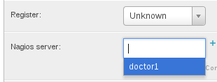
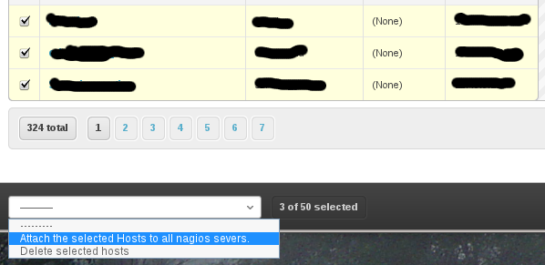
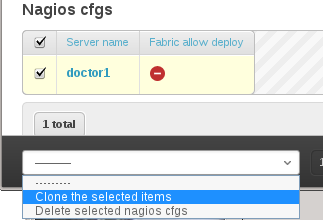

Importing and exporting data
============================

You can model your data from scratch, or you can import it as follows: 

.. role:: tdee

:tdee:`1.`  Copy your nagios "etc" directory into the import directory and import through the management command::
    
    > cd ~/app/steamer
    > mkdir -p cfg/import cfg/export
    > scp -r root@nagios1:/opt/local/nagios/etc  cfg/import/nagios1 
    > ~/app/manage.py import -s nagios1 -c nagios1/nagios.cfg -o /opt/local/nagios/etc/

    
The **-o** argument is the original path for the main config file, you mus ensure that all nagios cfg includes are inside that "etc" directory.
        

:tdee:`2.` **Relate** via the admin interface (http://steamerserver/admin/host) **each host with the imported nagios config**.

This can be done by host, editing its properties (Home › Djagios › Hosts › host_name).

|nserver|

*You can add multiple nagios servers instances to each host, which means that all those servers will include this host and this hosts dependencies on its config.*

Also you can do it by selecting a multiple hosts and using the admin action "Attach the selected host to all nagios instances" as shown below.
|to_all|
    
.. note::    
    While you can't import two different configs, you can merge and import them, then, simply clone the nagios config instance via the admin if you are interested in deploying multiple nagios instances. 

|clone|

When you relate a host to a nagios instance, you 're limiting the exported config to the dependencies of the servers's hosts, the only global resources for steamer |release| (the ones which always get exported) are "commands/check-commands and contacts/groups"). 

:tdee:`3.` Export : There are three ways of doing this:
Ensure that the user running steamer is able to do password-less ssh connections to the nagios user on the remote machines, this is really dangerous for the normal www user, that's why it is recommended running steamer with a different user.

In order to work correctly steamer will read its ~/.ssh/config file, so for each server you must provide a key_file as seen below.:: 

        Host nagios-?int*
            user nagios
            IdentityFile ~/.ssh/id_dsa

1. Via the command line::

    > ./manage.py export -s servername
    
2. Via admin site nagios_server's management commands:

    **TODO:image here**
    
3. Via the Lite app:

    **TODO:image here**

  
